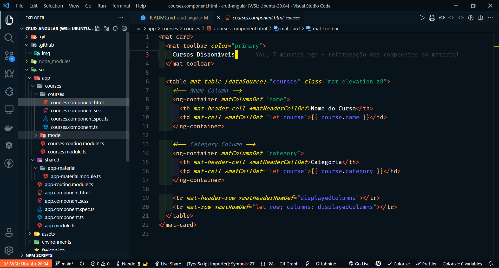

<h1 align="center">Curso Angular + Spring</h1>
<br />
<p align="center">
  
</p>

<p align="center">
  

  

  

  
</p>
<br>

## 🧪 Tecnologias utilizadas

Para este projeto, foram utilizadas as seguintes tecnologias e recursos:

- [Angular CLI versão 12.2.3](https://github.com/angular/angular-cli)
- [Typescript](https://www.typescriptlang.org/)
- [Prettier](https://prettier.io/)
- [ESLint](https://eslint.org/)

## 🚀 Como executar

Passo 1: Faça a clonagem do projeto com o comando abaixo:

```bash
$ git clone https://github.com/fsclaro/curso-angular-spring
```

Passo 2: Entre na pasta do projeto:

```bash
$ cd curso-angular-spring
```

Passo 3: Inicie o projeto conforme os passos descritos abaixo:

```bash
# Instalar as dependências
$ yarn

# Iniciar o projeto
$ yarn start
```

O app estará disponível no seu browser pelo endereço http://localhost:4200.

## ⌨️ Principais Comandos

```bash
$ yarn build
```
Para gerar a aplicação para ser enviada para produção

```bash
$ yarn test
```
Executa o Jest nos testes existentes na pasta src do projeto.

## 📝 Licença

Esse projeto está sob a licença MIT. Veja o arquivo [LICENSE](LICENSE.md) para mais detalhes.

---

Feito com ❤️ by NandoSalles.
